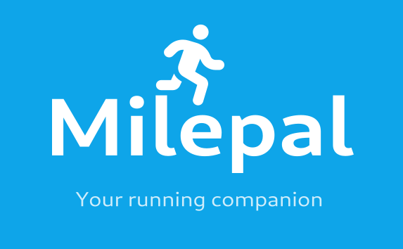
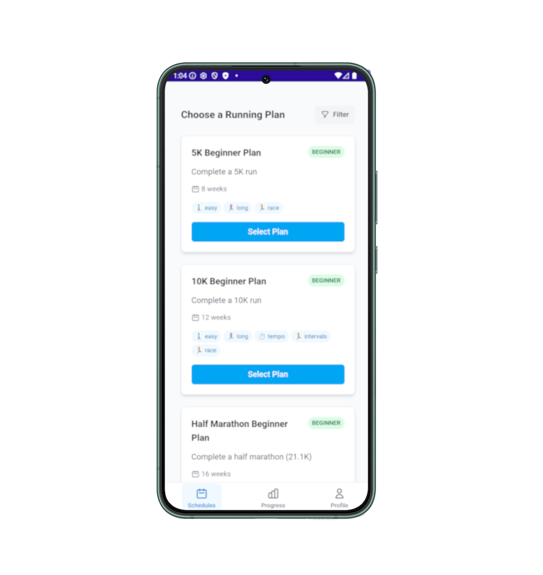

<div align="center">



# 🏃‍♂️ Milepal

**Your personal running companion** - A modern hybrid mobile app that helps runners create, follow, and track their training plans.


</div>

## ✨ Features

### 🎯 **Training Plans**
- **Multiple difficulty levels**: Beginner to Advanced programs
- **Goal-oriented schedules**: 5K, 10K, and Half Marathon training
- **Structured progression**: 8-16 week comprehensive plans
- **Workout variety**: Easy runs, tempo, intervals, long runs, and rest days

### 📊 **Progress Tracking**
- **Workout completion tracking** with rating system
- **Personal statistics**: Total distance, runs completed, current streak
- **Notes and feedback** for each workout session

### 🔒 **Privacy-First**
- **100% local storage** - no data leaves your device
- **No tracking or analytics** - your privacy is protected
- **Offline-first** - works without internet connection
- **No account required** - start using immediately

## 🛠️ Technology Stack

### Native Mobile App
- **.NET MAUI 9.0** - Cross-platform native framework
- **C#** - Modern, type-safe development
- **Target Platforms**: iOS, Android, Windows, macOS

### Web Interface
- **SolidJS** - Fast, reactive web framework
- **TypeScript** - Type-safe JavaScript development
- **Tailwind CSS** - Utility-first styling
- **Vite** - Fast build tool and dev server

### Architecture
- **Hybrid App Design** - Native shell with web UI
- **Local Storage** - Browser-based data persistence

## 🚀 Quick Start

### Prerequisites
- **.NET 9.0 SDK** or later
- **Node.js 18+** with npm/yarn
- **Platform-specific tools** (Xcode for iOS, Android SDK, etc.)

### Development Setup

1. **Clone the repository**
   ```bash
   git clone https://github.com/yourusername/milepal.git
   cd milepal
   ```

2. **Install web dependencies**
   ```bash
   cd Web
   npm install
   ```

3. **Start development servers**
   ```bash
   # Terminal 1: Start web dev server
   cd Web
   npm run dev
   
   # Terminal 2: Start MAUI app
   dotnet build
   dotnet run
   ```

4. **The app automatically connects to the dev server for hot reload! 🔥**

## 📱 Platform Support

Only Android is supported at this time.

| Platform | Status              | Notes |
|----------|---------------------|-------|
| **Android** | ✅ Supported         | API 21+ (Android 5.0+) |
| **iOS** | ❌ Not yet supported |  |
| **Windows** | ❌ Not yet supported |  |
| **macOS** | ❌ Not yet supported |  |

## 🎨 Screenshots

<div align="center">



*Milepal's clean, intuitive interface designed for runners*

</div>

## 🏗️ Project Structure

```
milepal/
├── 📱 MAUI App (Root)
│   ├── Pages/           # MAUI pages and views
│   ├── Utilities/       # WebView helpers and utilities
│   ├── Resources/       # Native assets (icons, splash)
│   └── Platforms/       # Platform-specific code
├── 🌐 Web/ (SolidJS App)
│   ├── src/
│   │   ├── components/  # Reusable UI components
│   │   ├── pages/       # App screens/pages
│   │   ├── utils/       # Helper functions
│   │   └── data/        # Training schedules and data
│   └── public/          # Static assets
└── 📚 Docs/
    └── CLAUDE.md        # Development guide
```

## 🔧 Development Workflow

### Web Development
```bash
cd Web
npm run dev          # Start dev server with HMR
npm run build        # Build for production
npm run preview      # Preview production build
```

### Native Development
```bash
dotnet build                    # or
dotnet build -f net9.0-android # Build for Android
```

## 🧪 Device Testing

### Android Emulator
- Automatically connects to `10.0.2.2:3000`
- Hot reload works out of the box

### Physical Devices
- Ensure device and dev machine are on same network
- App auto-detects development machine IP
- Manual IP configuration available in `WebViewHelper.cs`

## 🚀 Production Build

1. **Build web assets**
   ```bash
   cd Web
   npm run build
   ```

2. **Build native app**
   ```bash
   dotnet publish -c Release -f net9.0-android
   ```

3. **Assets are automatically bundled into the native app**

## 📄 License

This project is licensed under GNU GPLv3 - see the [LICENSE](LICENSE) file for details.

---
